# TicketBeat

Plataforma en línea para la compra y gestión de entradas a eventos musicales. Permite buscar eventos, comprar boletos (General, Reservado o VIP) bajo políticas de compra configurables por evento, pagar con distintos medios, y da soporte a los compradores ante incidentes y cancelaciones.

## Funcionalidad del Sistema

- **Boletos:** cada evento ofrece boletos General, Reservado y VIP, cada uno con su propio precio y detalles.
- **Compra y pago:** un comprador reserva boletos y paga con tarjeta, pago móvil o transferencia; el sistema confirma el pago y marca los boletos como vendidos.
- **Políticas de compra:** cada evento puede exigir edad mínima, límite de boletos por comprador y/o membresía de socio, en cualquier combinación.
- **Cancelación y devolución:** si un evento se cancela, el sistema aplica la política de devolución correspondiente y notifica a los compradores de los boletos afectados.
- **Soporte e incidentes:** un comprador puede reportar un incidente; se intenta resolver en primer nivel y, si no se puede, escala automáticamente a administración.

## Patrones de Diseño Aplicados

| Patrón | Dónde se usa | Para qué |
|---|---|---|
| **Factory Method** | `CreadorBoleto` y sus 3 subclases (`CreadorBoletoGeneral`, `CreadorBoletoReservado`, `CreadorBoletoVIP`) | Crear cada tipo de boleto sin que el código cliente conozca la clase concreta. |
| **Strategy** | `EstrategiaPago` y sus 3 implementaciones (tarjeta, pago móvil, transferencia) | Intercambiar el medio de pago en tiempo de ejecución sin condicionales. |
| **Decorator** | `IPoliticaCompra`, `PoliticaEventoBase` y sus 3 decoradores (límite de boletos, restricción de socio, verificación de edad) | Combinar restricciones de compra en cualquier orden, sin una clase por combinación. |
| **Chain of Responsibility** | `ManejadorIncidente`, `AgenteSoporte` → `DepartamentoAdministracion` | Escalar un incidente automáticamente al siguiente nivel si el primero no puede resolverlo. |

## Diagrama de Clases

```mermaid
classDiagram
    direction TB

    %% ===================== INTERFACES =====================
    class IBoleto {
        <<interface>>
        +mostrarDetalles()
        +getEstado() EstadoBoleto
        +setEstado(EstadoBoleto)
        +getPrecio() double
        +getComprador() Comprador
        +setComprador(Comprador)
    }

    class IPoliticaCompra {
        <<interface>>
        +validarCompra(Comprador, int) boolean
        +calcularReembolso(double) double
        +permiteCambioFecha() boolean
        +aplicarPoliticaDevolucion(Evento) List
    }

    class EstrategiaPago {
        <<interface>>
        +procesarPago(double, Map) Pago
        +revertirPago(String) boolean
    }

    class ICanal {
        <<interface>>
        +enviar(String) boolean
        +verificarDisponibilidad() boolean
    }

    %% ===================== FACTORY METHOD =====================
    class CreadorBoleto {
        <<abstract>>
        +crearBoleto() IBoleto
        +procesarEmision()
    }
    class CreadorBoletoGeneral
    class CreadorBoletoReservado
    class CreadorBoletoVIP

    class BoletoAbstracto {
        <<abstract>>
        #estado EstadoBoleto
        #precio double
        #comprador Comprador
    }
    class BoletoGeneral
    class BoletoReservado
    class BoletoVIP

    CreadorBoleto <|-- CreadorBoletoGeneral
    CreadorBoleto <|-- CreadorBoletoReservado
    CreadorBoleto <|-- CreadorBoletoVIP
    CreadorBoleto ..> IBoleto : crea
    IBoleto <|.. BoletoAbstracto
    BoletoAbstracto <|-- BoletoGeneral
    BoletoAbstracto <|-- BoletoReservado
    BoletoAbstracto <|-- BoletoVIP
    CreadorBoletoGeneral ..> BoletoGeneral : crea
    CreadorBoletoReservado ..> BoletoReservado : crea
    CreadorBoletoVIP ..> BoletoVIP : crea

    %% ===================== STRATEGY =====================
    class AbstractEstrategiaPago {
        <<abstract>>
        +mensajeProcesamiento() String
        +mensajeReversion() String
    }
    class PagoTarjetaStrategy
    class PagoMovilStrategy
    class PagoTransferenciaStrategy

    EstrategiaPago <|.. AbstractEstrategiaPago
    AbstractEstrategiaPago <|-- PagoTarjetaStrategy
    AbstractEstrategiaPago <|-- PagoMovilStrategy
    AbstractEstrategiaPago <|-- PagoTransferenciaStrategy

    %% ===================== DECORATOR =====================
    class PoliticaEventoBase
    class PoliticaDecorator {
        <<abstract>>
        #componente IPoliticaCompra
    }
    class LimiteBoletosDecorator
    class RestriccionSocioDecorator
    class VerificacionEdadDecorator

    IPoliticaCompra <|.. PoliticaEventoBase
    IPoliticaCompra <|.. PoliticaDecorator
    PoliticaDecorator o-- IPoliticaCompra : envuelve
    PoliticaDecorator <|-- LimiteBoletosDecorator
    PoliticaDecorator <|-- RestriccionSocioDecorator
    PoliticaDecorator <|-- VerificacionEdadDecorator

    %% ===================== CHAIN OF RESPONSIBILITY =====================
    class ManejadorIncidente {
        <<abstract>>
        #siguienteManejador ManejadorIncidente
        +manejarIncidente(Incidente)
    }
    class AgenteSoporte
    class DepartamentoAdministracion

    ManejadorIncidente <|-- AgenteSoporte
    ManejadorIncidente <|-- DepartamentoAdministracion
    ManejadorIncidente o-- ManejadorIncidente : siguiente

    %% ===================== SERVICIOS (CANALES) =====================
    class CanalEmail
    class CanalSMS
    ICanal <|.. CanalEmail
    ICanal <|.. CanalSMS

    %% ===================== GESTORES =====================
    class GestorEventos {
        -notificador GestorNotificaciones
        +solicitarResumenEvento(Evento)
        +confirmarCancelacion(String, Evento)
    }
    class GestorReservas {
        -estrategiaPago EstrategiaPago
        -comprador Comprador
        -reservaActual Reserva
        +elegirCantidadYTipoDeEntrada()
        +confirmarCompra(double, Map)
        +tiempoDeReservaExpirado()
    }
    class GestorIncidentes {
        -cadenaSoporte ManejadorIncidente
        +registrarIncidente(String)
    }
    class GestorNotificaciones {
        +iniciarProcesoDeNotificacion(List, String)
        +notificarCompradores(List, String)
        +notificarResolucion(Comprador, String)
    }

    GestorEventos --> GestorNotificaciones : usa
    GestorReservas --> EstrategiaPago : usa
    GestorReservas --> Reserva : crea
    GestorIncidentes --> ManejadorIncidente : usa

    %% ===================== MODELO =====================
    class Usuario {
        <<abstract>>
        #id String
        #nombre String
        #email String
        #telefono String
    }
    class Comprador {
        -canalPreferido ICanal
        -edad int
        -esSocio boolean
    }
    class Organizador {
        -nombreEmpresa String
    }
    class Evento {
        -estado EstadoEvento
        -boletos List
        -politica IPoliticaCompra
        +obtenerBoletosParaDevolucion() List
    }
    class Incidente {
        -descripcion String
        -estado EstadoIncidente
    }
    class Pago {
        -monto double
        -estado EstadoPago
        +estaCompletado() boolean
    }
    class Reserva {
        -comprador Comprador
        -boletosReservados List
        -fechaExpiracion Date
    }
    class NotificacionMensaje {
        -asunto String
        -contenido String
    }

    Usuario <|-- Comprador
    Usuario <|-- Organizador
    Comprador o-- ICanal : canalPreferido
    Evento o-- IPoliticaCompra : politica
    Evento o-- IBoleto : boletos
    Reserva o-- Comprador : comprador
    Reserva o-- IBoleto : boletosReservados
    IBoleto --> Comprador : comprador
```

> Los estados (`EstadoBoleto`, `EstadoEvento`, `EstadoPago`, `EstadoIncidente`) se modelan como enums y se omiten del diagrama como cajas aparte para mantenerlo legible; aparecen como el tipo de cada atributo `estado`.
